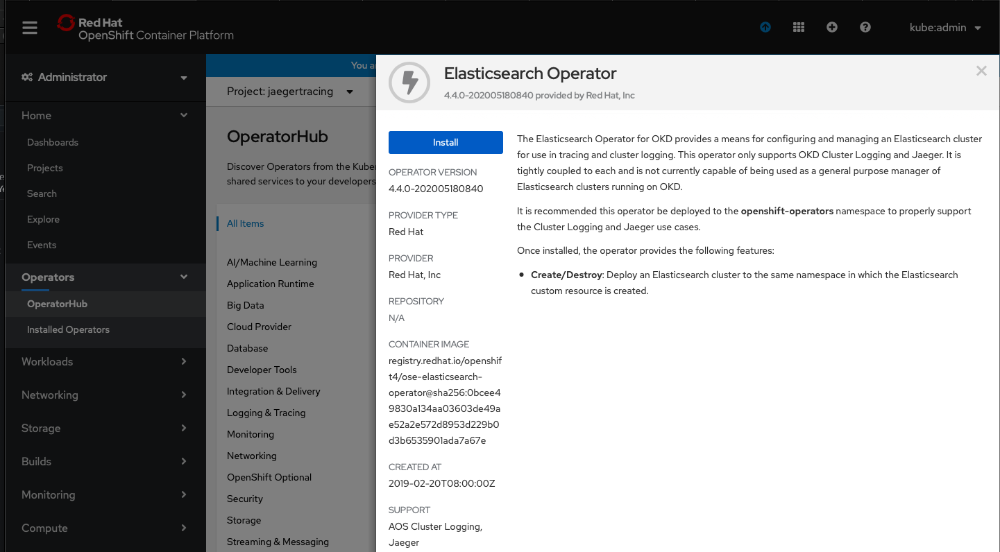
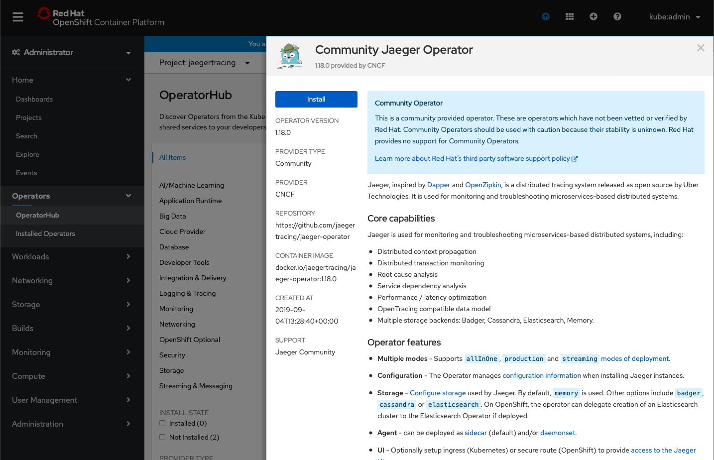
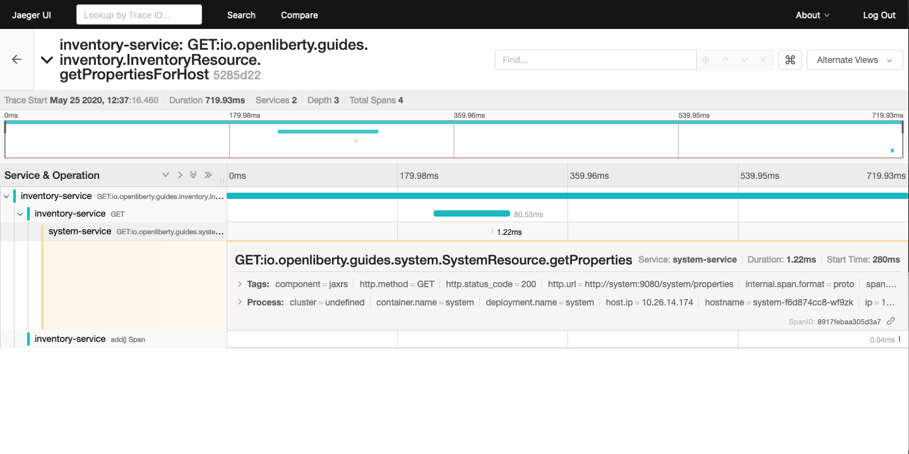

# How to do distributed tracing on Red Hat OpenShift with Jaeger

## Introduction

With the ever growing adoption of cloud native application development and microservice architecture, the applications being deployed to the cloud are now comprised of from a few to hundreds of microservices. In order to track the inter communication between each individual microservices, distributed tracing has been implemented to help DevOps teams to keep track of requests being relayed from one service to another. Among all the distributed tracing frameworks, Jaeger and Zipkin are the most popular stack loved by the developers. In the context of Red Hat OpenShift (we will simply it refer it to OpenShift from this point on), Jaeger is arguably the more popular choice for distributed tracing as it's already an integral component of the Red Hat OpenShift Service Mesh framework. Speaking of Red Hat OpenShift Service Mesh, it is the complete solution to optimize the network of deployed microservices on OpenShift with functions like load balancing, service-to-service securities, distributed tracing and monitoring, etc. If you are looking for the complete all in one solution for macro-managing your microservices on OpenShift, take a look at the [Red Hat OpenShift Service Mesh documents](https://docs.openshift.com/container-platform/4.4/service_mesh/service_mesh_arch/understanding-ossm.html). For developers who are interested only in the distributed tracing side of the equation, the following sections will explain in detail on how to deploy and configure Jaeger and the microservice applications properly for tracing.

## Install Jaeger Operator

The best way to deploy Jaeger on OpenShift is using the Jaeger Operator. It's extremely easy to install via the use of Operator Hub. It also helps the user to automate the setup of many security related configurations. We will also choose a backend storage solution to persist the data. For Jaeger, the official supported storage options are either Cassandra or Elasticsearch. For this article, I'll pick Elasticsearch due to my past familiarity with Elasticsearch before.

Before the installation, let's first create a new project on our OpenShift cluster called **jaegertracing**.
```
oc new-project jaegertracing
```

Next, we'll first install Elasticsearch Operator and then Jaeger Operator. This is so that the Jaeger Operator can self provision any existing Elasticsearch Opeartor with their generated certificates stored as the Kubernetes Secrets.

To install Elasticsearch Operator, navigate to the Operator Hub and search for Elasticsearch. Follow the prompt to install the operator and make sure that it is installed to the **jaegertracing** project created earlier.


*Figure 1: Elasticsearch Operator installation via Operator Hub*

After the installation of Elasticsearch Operator, follow the similar steps on the Operator Hub to install the Jaeger Operator. Similarly, make sure that it is installed to the same **jaegertracing** project.


*Figure 2: Jaeger Operator installation via Operator Hub*

After the installation of both Elasticsearch Operator and Jaeger Operator, navigate to the Installed Operators page to verify that both of operators have been installed successfully.

## Configure Jaeger Operator

Before creating a Jaeger instance, let's recap on the Jaeger components. The Jaeger is comprised of agent, collector and query three main components. Additionally, there is also Jaeger client which is part of your application responsible for instrumenting the application and creating spans. And finally, Jaeger makes use of third party storage solutions such as Cassandra and Elasticsearch for data persistence. The overall architecture is illustrated in the diagram below.


*Figure 3: Typical production grade Jaeger architecture*

Next, we need to figure out which deployment strategy to use. A deployment strategy dictates how the Jaeger components should be deployed on OpenShift. The Jaeger CR from Jaeger Operator offers three types of deployment strategy:
**1. allInOne**
**2. Production**
**3. Streaming**

As tempting as one might want to use the default allInOne strategy, its extremely limited capability makes it not suitable for even some serious test/development settings. As the name suggests, allInOne strategy packs the agent, collector and query in a single pod. It's an easy way to start and manage all Jaeger components for some POC works. However there are two limitations that severely handicap the potential of this setup. For one, the allInOne strategy is using memory as its backend storage, so there is no real data persistence as killing the pod will wipe out all the previously collected trace spans. And secondly, allInOne does not allow any scaling as the replica count is locked to 1.

Production strategy in contrast deploys the collector and query processes individually as separate pods on OpenShift, and can be scaled individually on demand. In addition, it supports secured connection with backend storage services like Cassandra and Elasticsearch, which fits our need perfectly. Streaming strategy is essentially production strategy with added support for streaming platform like Kafka, which we will ignore for now for the sake of simplicity.

Let's proceed to create the jaeger yaml file

```
apiVersion: jaegertracing.io/v1
kind: Jaeger
metadata:
  name: simple-prod
spec:
  strategy: production
  storage:
    type: elasticsearch
    elasticsearch:
      nodeCount: 1
      resources:
        requests:
          cpu: 200m
          memory: 1Gi
        limits:
          memory: 1Gi
```

Note that there is barely any detailed configuration for Elasticsearch in the Jaeger yaml file. The Jaeger Operator is able to detect existing Elasticsearch instanced deployed by the Elasticsearch Operator, and auto-provision the secured communication between Elasticsearch and Jaeger processes.

Create the Jaeger instance using the yaml file above. Upon successful creation of the Jaeger instance, the following pod processes will be running on your cluster.

```
[root@fwji1-ocp43-inf ~]# oc get pods
NAME                                                           READY   STATUS      RESTARTS   AGE
elasticsearch-cdm-jaegertrarcingsimpleprod-1-cb8fd749b-kqtkx   2/2     Running     0          50d
simple-prod-collector-6f654659bb-8868l                         1/1     Running     0          9d
simple-prod-query-864dfd87b4-wxrps                             2/2     Running     0          12h
```

## Prepare your application for OpenShift

You might wonder why there is no agent pod running after the creation of the Jaeger instance. That's because the agent is supposed to be injected as a sidecar container within the application pod in production (and streaming) strategy. The auto injection of the agent side car can be done through annotating the **Namespace** or **Deployments** with **sidecar.jaegertracing.io/inject: "true"** annotation. For controller types other than **Deployment** (ie. StatefulSet, DeploymentConfig, etc), the jaeger agent sidecar must be explicitly defined in the container spec. An example of a StatefulSet with Jaeger agent sidecar container is available at here.

Below is a sample deployment with automatic agent sidecar injection. We also defined some environment variables that are used by the Jaeger client in my sample application.

```
apiVersion: apps/v1
kind: Deployment
metadata:
  annotations:
    sidecar.jaegertracing.io/inject: "true"
  creationTimestamp: null
  labels:
    app: system
  name: system
spec:
  replicas: 1
  selector:
    matchLabels:
      app: system
  strategy:
    resources: {}
  template:
    metadata:
      creationTimestamp: null
      labels:
        app: system
    spec:
      containers:
      - env:
        - name: JAEGER_REPORTER_LOG_SPANS
          value: "true"
        - name: JAEGER_SAMPLER_PARAM
          value: "1"
        - name: JAEGER_SAMPLER_TYPE
          value: const
        image: 'frankji/system-image'
        name: system
        ports:
        - containerPort: 9080
        - containerPort: 9443
        resources: {}
      restartPolicy: Always
  test: false
status: {}
```
Once deployed, the application pod will be created with a Jaeger agent sidecar. You should then be able to see the trace spans generated by the application on the Jaeger query UI.


*Figure 4: Jaeger tracing spans displayed on Jaeger UI*

## Additional Configurations

The above example provided a typical Jaeger setup on OpenShift. However depending on the actual use cases and the requirements, there are many other configurations that are possible with Jaeger Operator. For instance, the Elasticsearch used in this example can be replaced with an external Elasticsearch link. Another important configuration is the collector sampling strategies. In a production microservice environment, it may be too expensive to collect and store every trace span reported from the client. As such, a user can configure the collector to use either a probabilistic based or a rate limiting based sampling strategy to reduce the frequency of trace collection. For more advanced users, the addition of a streaming platform like Apache Kafka with the streaming strategy is definitely a worthwhile investment. Not only it can reduce the load on the backend storage during peak loads with its additional layer of storage, it also provides the opportunity for data ingestion on the collected tracing data that can give users more insight on their microservices system.

## Summary

Distributed tracing has become an essential in the world of observability for microservices. With Jaeger Operator, averages users can now start doing distributed tracing on OpenShift with minimum manual configuration. Yet it still offers tons of configurables for advanced users to leverage the full potential of Jaeger. If you want to learn more about Jaeger, the [Jaeger home page](https://www.jaegertracing.io) is still the best resource for Jaeger and Jaeger Operator contents.
